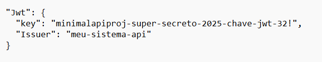

#  Minimal API - Gestão de Administradores e Veículos

Este projeto é uma **API minimalista desenvolvida em .NET 9** para gerenciar **Administradores** e **Veículos**, com autenticação **JWT**, persistência em **MySQL** e documentação interativa via **Swagger**.


## Índice

1. [Pré preparo para início do projeto](#pré-preparo-para-início-do-projeto)  
2. [Criar e executar o projeto](#criar-e-executar-o-projeto)  
3. [Ignorar pastas](#ignorar-algumas-pastas)  
4. [Banco de Dados e Migrations](#migrations)  
5. [JWT](#jwt)  
6. [Soluções e estrutura do projeto](#criar-solução-para-o-projeto)  
7. [Projeto de Teste](#criar-um-projeto-de-teste)  
8. [Comandos adicionais](#comandos-adicionais)  
9. [Tecnologias utilizadas](#tecnologias-utilizadas)  
10. [Execução e endpoints da API](#exemplos-de-requisições)  
11. [Licença e autoria](#licença)

---
##  Estrutura do Projeto


---
## Tecnologias Utilizadas

| Tecnologia | Descrição |
|-------------|------------|
| **.NET 9.0** | Framework principal da aplicação |
| **Entity Framework Core 9** | ORM para acesso ao banco de dados |
| **MySQL** | Banco de dados relacional |
| **JWT (JSON Web Token)** | Autenticação e autorização |
| **Swagger / Swashbuckle** | Documentação e teste da API |
| **MSTest + Moq** | Frameworks de teste unitário e mock |
| **Pomelo.EntityFrameworkCore.MySql** | Provedor MySQL para o EF Core |

---

## Pré-requisitos

Antes de iniciar, certifique-se de ter instalado:

- [.NET SDK 9.0](https://dotnet.microsoft.com/pt-br/download)
- [MySQL Server](https://www.oracle.com/mysql/technologies/mysql-enterprise-edition-downloads.html#windows)
- [VSCode](https://code.visualstudio.com/)
- Extensões recomendadas:
  -  **C#**
  - **.NET Install Tool**

---
### Pacotes do Entity Framework e outros

- [Microsoft.EntityFrameworkCore 9.0.1](https://www.nuget.org/packages/Microsoft.EntityFrameworkCore/9.0.1)  
- [Microsoft.EntityFrameworkCore.Design 9.0.1](https://www.nuget.org/packages/Microsoft.EntityFrameworkCore.Design/9.0.1)  
- [Microsoft.EntityFrameworkCore.Tools 9.0.1](https://www.nuget.org/packages/Microsoft.EntityFrameworkCore.Tools/9.0.1)  
- [Pomelo.EntityFrameworkCore.MySql](https://www.nuget.org/packages/Pomelo.EntityFrameworkCore.MySql)  
- [Swashbuckle.AspNetCore](https://www.nuget.org/packages/Swashbuckle.AspNetCore)  
- [System.Text.Json 9.0.4](https://www.nuget.org/packages/System.Text.Json/9.0.4)  
- [Microsoft.AspNetCore.Authentication.JwtBearer 9.0.6](https://www.nuget.org/packages/Microsoft.AspNetCore.Authentication.JwtBearer/9.0.6)


---

##  Configuração do Ambiente e Conexão com o Banco de Dados

Edite o arquivo `appsettings.json` na pasta **API** e configure sua conexão MySQL:

```json
"ConnectionStrings": {
  "mysql": "server=127.0.0.1;port=3306;database=minimal_api;user=root;password=230277;"
}

---


## Executando o Projeto

### Criar o Projeto

- dotnet new web -o minimal-api

### Restaurar dependências
- dotnet restore

### Executar o projeto
- dotnet run # ou dotnet watch run

---
## A API ficará disponível em:

- HTTP: http://localhost:5009

- Swagger: http://localhost:5009/swagger

---
## Pacotes Utilizados
- Microsoft.AspNetCore.Authentication.JwtBearer 9.0.6
- Microsoft.EntityFrameworkCore 9.0.1
- Microsoft.EntityFrameworkCore.Design 9.0.1
- Microsoft.EntityFrameworkCore.Tools 9.0.1
- Pomelo.EntityFrameworkCore.MySql 9.0.0
- Swashbuckle.AspNetCore 9.0.6
- System.Text.Json 9.0.4


## Banco de Dados & Migrations

### Instalar o CLI do EF Core
- dotnet tool install --global dotnet-ef
- dotnet ef --version

### Criar Migrations
- dotnet ef migrations add AdministradorMigration
- dotnet ef migrations add VeiculosMigration

### Atualizar o Banco
- dotnet ef database update

### Visualizar tabelas no MySQL

acessar banco de dado Mysql: mysql -u root -p
usar o banco de dados DATABASE dentro do Mysql: USE minimal_api;
visulizar dentro do Mysql: SHOW TABLES;
selecionar toda a tabela dentro do Mysql: SELECT * FROM administradores;
mostra a estrutura da tabela no banco de dados: DESC veiculos;

### Exportar e Restaurar Banco
- mysqldump -u root -p minimal_api > minimal_api.dump.sql
- mysql -u root -p minimal_api < minimal_api.dump.sql

## JWT (JSON Web Token)

- Implementação baseada no pacote Microsoft.AspNetCore.Authentication.JwtBearer.

- Configuração do segredo em appsettings.json:


### Teste o token em:
linl: https://www.jwt.io/


# Projeto de Testes
O projeto Test cobre as entidades, serviços e mocks da API utilizando MSTest e Moq.

## Criar o Projeto de Teste
- dotnet new mstest -o Test

## Adicionar Referência à API
- entrar na pasta: cd Test
- adiciona a referencia: dotnet add reference ../API/minimal-api.csproj

## Executar os Testes
- dotnet test

# Estrutura de Testes:

- Domain/Entidade/AdministradorTest.cs → testa propriedades da entidade.

- Mock/AdministradorServicoMockTest.cs → simula serviço de administradores.

- Mock/VeiculoServicoMockTest.cs → simula serviço de veículos.

- Requests/AdministradorRequestTest.cs e VeiculoRequestTest.cs → valida requisições.


# Build do Projeto

- dotnet build

# Utilitários

## Criar solução

- dotnet new sln
- dotnet sln add API/minimal-api.csproj
- dotnet sln add Test/Test.csproj

# Ignorar pastas no Git

Use o modelo disponível em:

 https://www.toptal.com/developers/gitignore/


# Dicas Adicionais

- Listar templates disponíveis: dotnet new list
- Atualizar dependências: dotnet restore
- Abrir o projeto de teste: code Test


